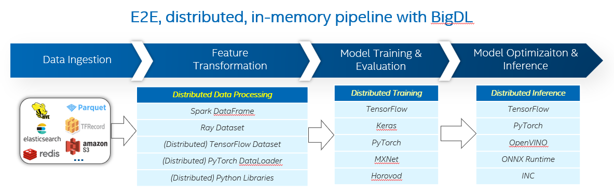

# Distributed Training & Inference Workflows using BigDL 

Learn to use BigDL to easily build and seamlessly scale distributed training and inference workflows
for TensorFlow and PyTorch. This page takes the recsys workflows for Wide & Deep Learning model as an example.

Check out more workflow examples and reference implementations in the [Developer Catalog](https://developer.intel.com/aireferenceimplementations).

## Overview
Usually one would take many efforts to develop distributed training and inference pipelines to handle large datasets in production.
With the adoption of BigDL, AI workflows written in Python notebooks running on a single laptop can be seamlessly
scaled out across large clusters so as to process distributed Big Data.

Highlights and benefits of BigDL are as follows:

- Easily build efficient in-memory, distributed data analytics and AI pipelines that runs on a single Intel® Xeon cluster.
- Seamlessly scale TensorFlow and PyTorch applications to big data platforms.
- Direct deployment on production clusters including Hadoop/YARN and Kubernetes clusters.


For more details, visit the BigDL [GitHub repository](https://github.com/intel-analytics/BigDL/tree/main) and
[documentation page](https://bigdl.readthedocs.io/en/latest/).

## Hardware Requirements

| Recommended Hardware         | Precision  |
| ---------------------------- | ---------- |
| Intel® 4th Gen Xeon® Scalable Performance processors|BF16 |
| Intel® 1st, 2nd, 3rd, and 4th Gen Xeon® Scalable Performance processors| FP32 |


## How it Works



The architecture above illustrates how BigDL can build end-to-end, distributed and in-memory pipelines on Intel® Xeon clusters.

- BigDL supports loading data from various distributed data sources and data formats that are widely used in the big data ecosystem.
- BigDL supports distributed data processing with Spark DataFrame, Ray Dataset, or scaling common Python data libraries using [XShards](https://bigdl.readthedocs.io/en/latest/doc/Orca/Overview/data-parallel-processing.html#xshards-distributed-data-parallel-python-processing).
- BigDL supports seamlessly scaling many popular deep learning frameworks and includes runtime optimizations on Xeon.

## Get Started

### Download the Workflow Repository
Create a working directory for the workflow and clone the [Main
Repository](https://github.com/intel-analytics/BigDL) repository into your working
directory.

```
mkdir ~/work && cd ~/work
git clone https://github.com/intel-analytics/BigDL.git
cd BigDL
git checkout ai-workflow
```

### Download the Datasets

This workflow uses the [Twitter Recsys Challenge 2021 dataset](http://www.recsyschallenge.com/2021/), each record of which contains the tweet along with engagement features, user features, and tweet features.

The original dataset includes 46 million users and 340 million tweets (items). Here in this workflow, we provide a script to generate some dummy data for this dataset. In the running command below, you can specify the number of records to generate and the output folder respectively.

```
cd apps/wide-deep-recommendation
mkdir recsys_data
# You can modify the number of records and the output folder when running the script
python generate_dummy_data.py 100000 recsys_data/
cd ../..
```

---

## Run Training Using Docker
Follow these instructions to set up and run our provided Docker image.
For running on bare metal, see the [bare metal instructions](#run-using-bare-metal)
instructions.

### Set Up Docker Engine
You'll need to install Docker Engine on your development system.
Note that while **Docker Engine** is free to use, **Docker Desktop** may require
you to purchase a license.  See the [Docker Engine Server installation
instructions](https://docs.docker.com/engine/install/#server) for details.

If the Docker image is run on a cloud service, mention they may also need
credentials to perform training and inference related operations (such as these
for Azure):
- [Set up the Azure Machine Learning Account](https://azure.microsoft.com/en-us/free/machine-learning)
- [Configure the Azure credentials using the Command-Line Interface](https://docs.microsoft.com/en-us/cli/azure/authenticate-azure-cli)
- [Compute targets in Azure Machine Learning](https://learn.microsoft.com/en-us/azure/machine-learning/concept-compute-target)
- [Virtual Machine Products Available in Your Region](https://azure.microsoft.com/en-us/explore/global-infrastructure/products-by-region/?products=virtual-machines&regions=us-east)

### Set Up Docker Image
Pull the provided docker image.
```
docker pull intelanalytics/bigdl-spark-3.1.3:latest
```

If your environment requires a proxy to access the internet, export your
development system's proxy settings to the docker environment:
```
export DOCKER_RUN_ENVS="-e ftp_proxy=${ftp_proxy} \
  -e FTP_PROXY=${FTP_PROXY} -e http_proxy=${http_proxy} \
  -e HTTP_PROXY=${HTTP_PROXY} -e https_proxy=${https_proxy} \
  -e HTTPS_PROXY=${HTTPS_PROXY} -e no_proxy=${no_proxy} \
  -e NO_PROXY=${NO_PROXY} -e socks_proxy=${socks_proxy} \
  -e SOCKS_PROXY=${SOCKS_PROXY}"
```

### Run Docker Image
Run the workflow using the ``docker run`` command, as shown:  (example)
```
# TODO: test and modify this

export DATASET_DIR=apps/recsys_data
export OUTPUT_DIR=/output
docker run -a stdout $DOCKER_RUN_ENVS \
  --env DATASET=${DATASET} \
  --env OUTPUT_DIR=${OUTPUT_DIR} \
  --volume ${DATASET_DIR}:/workspace/data \
  --volume ${OUTPUT_DIR}:/output \
  --volume ${PWD}:/workspace \
  --workdir /workspace \
  --privileged --init -it --rm --pull always \
  intel/ai-workflows:bigdl-training \
  ./run.sh
```

---

## Run Training Using Bare Metal
Follow these instructions to set up and run this workflow on your own development
system. For running a provided Docker image with Docker, see the [Docker
instructions](#run-using-docker).


### Set Up System Software
Our examples use the ``conda`` package and environment on your local computer.
If you don't already have ``conda`` installed, see the [Conda Linux installation
instructions](https://docs.conda.io/projects/conda/en/stable/user-guide/install/linux.html).

### Set Up Workflow
Run these commands to set up the workflow's conda environment and install required software:
```
# TODO: change backend to spark
conda create -n friesian python=3.8 --yes
conda activate friesian
pip install --pre --upgrade bigdl-friesian[train]
pip install tensorflow==2.9.0
```

### Run Workflow
Use these commands to run the workflow:
```
python python/friesian/example/wnd/recsys2021/wnd_preprocess_recsys.py \
    --executor_cores 8 \
    --executor_memory 10g \
    --input_train_folder apps/wide-deep-recommendation/recsys_data/train \
    --input_test_folder apps/wide-deep-recommendation/recsys_data/test \
    --output_folder apps/wide-deep-recommendation/recsys_data/preprocessed \
    --cross_sizes 600

python python/friesian/example/wnd/recsys2021/wnd_train_recsys.py \
    --executor_cores 8 \
    --executor_memory 10g \
    --data_dir apps/wide-deep-recommendation/recsys_data/preprocessed \
    --model_dir recsys_wnd/ \
    --batch_size 3200 \
    --epoch 5 \
    --learning_rate 1e-4 \
    --early_stopping 3

cd python/friesian/example/two_tower
python train_2tower.py \
    --executor_cores 8 \
    --executor_memory 10g \
    --data_dir apps/wide-deep-recommendation/recsys_data/preprocessed \
    --model_dir recsys_2tower/ \
    --batch_size 8000
```

## Expected Training Output
Check out the processed data and saved models of the workflow:
```
ll apps/wide-deep-recommendation/recsys_data/preprocessed
ll recsys_wnd/
ll recsys_2tower/
```
Check out the logs of the console for training results:

`wnd_train_recsys.py`:
```
22/25 [=========================>....] - ETA: 1s - loss: 0.2367 - binary_accuracy: 0.9391 - binary_crossentropy: 0.2367 - auc: 0.5637 - precision: 0.9392 - recall: 1.0000
23/25 [==========================>...] - ETA: 0s - loss: 0.2374 - binary_accuracy: 0.9388 - binary_crossentropy: 0.2374 - auc: 0.5644 - precision: 0.9388 - recall: 1.0000
24/25 [===========================>..] - ETA: 0s - loss: 0.2378 - binary_accuracy: 0.9386 - binary_crossentropy: 0.2378 - auc: 0.5636 - precision: 0.9386 - recall: 1.0000
25/25 [==============================] - ETA: 0s - loss: 0.2379 - binary_accuracy: 0.9385 - binary_crossentropy: 0.2379 - auc: 0.5635 - precision: 0.9385 - recall: 1.0000
25/25 [==============================] - 10s 391ms/step - loss: 0.2379 - binary_accuracy: 0.9385 - binary_crossentropy: 0.2379 - auc: 0.5635 - precision: 0.9385 - recall: 1.0000 - val_loss: 0.6236 - val_binary_accuracy: 0.8491 - val_binary_crossentropy: 0.6236 - val_auc: 0.4988 - val_precision: 0.9342 - val_recall: 0.9021
(Worker pid=11371) Epoch 4: early stopping
Training time is:  53.32298707962036
```
`train_2tower.py`:
```
7/10 [====================>.........] - ETA: 0s - loss: 0.3665 - binary_accuracy: 0.8124 - recall: 0.8568 - auc: 0.5007
8/10 [=======================>......] - ETA: 0s - loss: 0.3495 - binary_accuracy: 0.8282 - recall: 0.8747 - auc: 0.5004
9/10 [==========================>...] - ETA: 0s - loss: 0.3370 - binary_accuracy: 0.8403 - recall: 0.8886 - auc: 0.5002
10/10 [==============================] - ETA: 0s - loss: 0.3262 - binary_accuracy: 0.8503 - recall: 0.8998 - auc: 0.5002
10/10 [==============================] - 7s 487ms/step - loss: 0.3262 - binary_accuracy: 0.8503 - recall: 0.8998 - auc: 0.5002 - val_loss: 0.2405 - val_binary_accuracy: 0.9352 - val_recall: 1.0000 - val_auc: 0.4965
```

---

## Run Serving Using Docker
You are highly recommended to run the online serving pipeline for the recsys workflow using our provided Docker image.

### Set Up Docker Image
Pull the provided docker image.
```
docker pull intelanalytics/friesian-grpc:0.0.2
```

If your environment requires a proxy to access the internet, export your
development system's proxy settings to the docker environment:
```
export DOCKER_RUN_ENVS="-e ftp_proxy=${ftp_proxy} \
  -e FTP_PROXY=${FTP_PROXY} -e http_proxy=${http_proxy} \
  -e HTTP_PROXY=${HTTP_PROXY} -e https_proxy=${https_proxy} \
  -e HTTPS_PROXY=${HTTPS_PROXY} -e no_proxy=${no_proxy} \
  -e NO_PROXY=${NO_PROXY} -e socks_proxy=${socks_proxy} \
  -e SOCKS_PROXY=${SOCKS_PROXY}"
```

### Run Docker Image
Run the workflow using the ``docker run`` command, as shown:  (example)
```
docker run -itd --name friesian --net=host intelanalytics/friesian-grpc:0.0.2
docker exec -it friesian bash
```

### Run Workflow
1. Start ranking service
```bash
export OMP_NUM_THREADS=1
java -cp bigdl-friesian-serving-spark_2.4.6-0.14.0-SNAPSHOT.jar com.intel.analytics.bigdl.friesian.serving.ranking.RankingServer -c config_ranking.yaml > logs/inf.log 2>&1 &
```

2. Start feature service for ranking
```bash
./redis-5.0.5/src/redis-server &
java -Dspark.master=local[*] -cp bigdl-friesian-serving-spark_2.4.6-0.14.0-SNAPSHOT.jar com.intel.analytics.bigdl.friesian.serving.feature.FeatureServer -c config_feature.yaml > logs/feature.log 2>&1 &
```

3. Start feature service for recall
```bash
java -Dspark.master=local[*] -cp bigdl-friesian-serving-spark_2.4.6-0.14.0-SNAPSHOT.jar com.intel.analytics.bigdl.friesian.serving.feature.FeatureServer -c config_feature_vec.yaml > logs/fea_recall.log 2>&1 &
```

4. Start recall service
```bash
java -Dspark.master=local[*] -Dspark.driver.maxResultSize=2G -cp bigdl-friesian-serving-spark_2.4.6-0.14.0-SNAPSHOT.jar com.intel.analytics.bigdl.friesian.serving.recall.RecallServer -c config_recall.yaml > logs/vec.log 2>&1 &
```

5. Start recommender service
```bash
java -cp bigdl-friesian-serving-spark_2.4.6-0.14.0-SNAPSHOT.jar com.intel.analytics.bigdl.friesian.serving.recommender.RecommenderServer -c config_recommender.yaml > logs/rec.log 2>&1 &
```

6. Run the recommender client for the workflow
```bash
java -Dspark.master=local[*] -cp bigdl-friesian-serving-spark_2.4.6-0.14.0-SNAPSHOT.jar com.intel.analytics.bigdl.friesian.serving.recommender.RecommenderMultiThreadClient -target localhost:8980 -dataDir wnd_user.parquet -k 50 -clientNum 4 -testNum 2
```

7. Close services
```bash
ps aux|grep friesian (find the service pid)
kill xxx (pid of the service which should be closed)
```

See [here](https://github.com/intel-analytics/BigDL/tree/main/scala/friesian) for more detailed guidance to run the online serving workflow.

See [here](https://github.com/intel-analytics/BigDL/tree/main/apps/friesian-server-helm) to deploy the serving workflow on a Kubernetes cluster.

## Summary and Next Steps
Now you have successfully tried the recsys workflows of BigDL to build an end-to-end pipeline for Wide & Deep model.
You can continue to try other use cases provided in BigDL or build the training and inference workflows on your own dataset!

## Learn More
For more information about BigDL distributed training and inference workflows or to read about other relevant workflow
examples, see these guides and software resources:

- More BigDL workflow examples for TensorFlow: https://github.com/intel-analytics/BigDL/tree/main/python/orca/example/learn/tf2
- More BigDL workflow examples for PyTorch: https://github.com/intel-analytics/BigDL/tree/main/python/orca/example/learn/pytorch
- [Intel® AI Analytics Toolkit (AI Kit)](https://www.intel.com/content/www/us/en/developer/tools/oneapi/ai-analytics-toolkit.html)
- [Azure Machine Learning Documentation](https://learn.microsoft.com/en-us/azure/machine-learning/)

## Troubleshooting
- If you encounter the error `E0129 21:36:55.796060683 1934066 thread_pool.cc:254] Waiting for thread pool to idle before forking` during the training, it may be caused by the installed version of grpc. See [here](https://github.com/grpc/grpc/pull/32196) for more details about this issue. To fix it, a recommended grpc version is 1.43.0:
```bash
pip install grpcio==1.43.0
```

## Support
If you have questions or issues about this workflow, contact the Support Team through [GitHub](https://github.com/intel-analytics/BigDL/issues) or [Google User Group](https://groups.google.com/g/bigdl-user-group).
